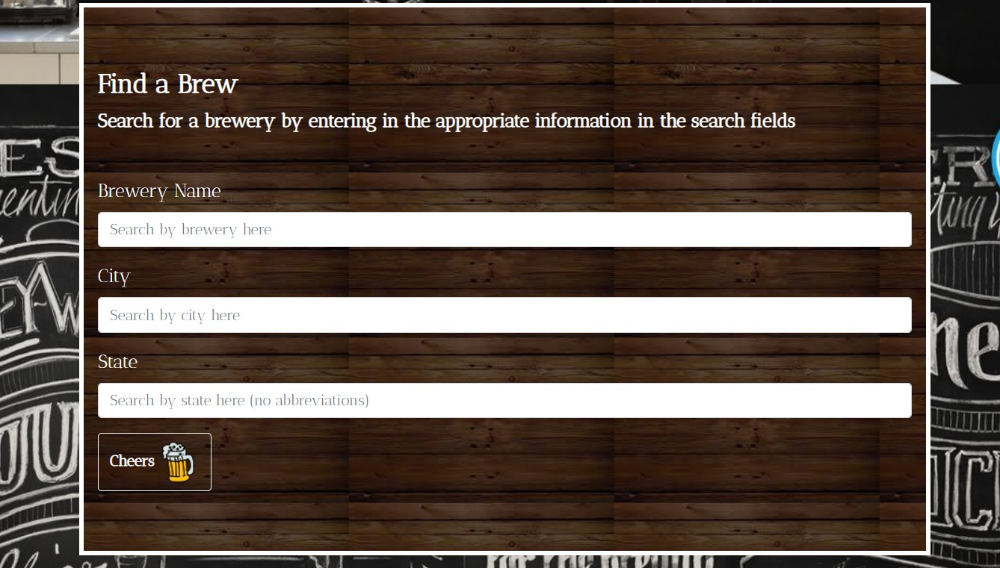
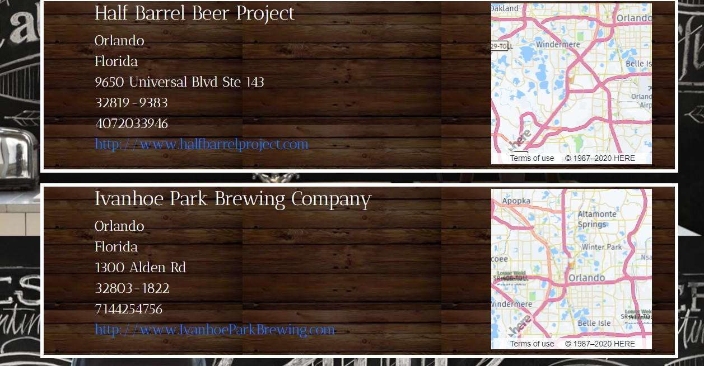
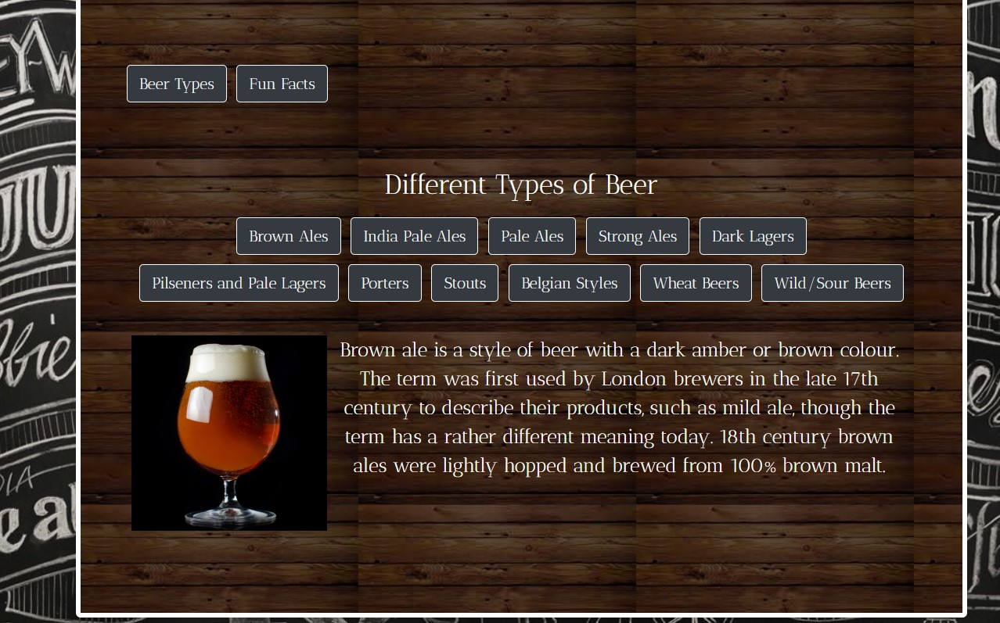
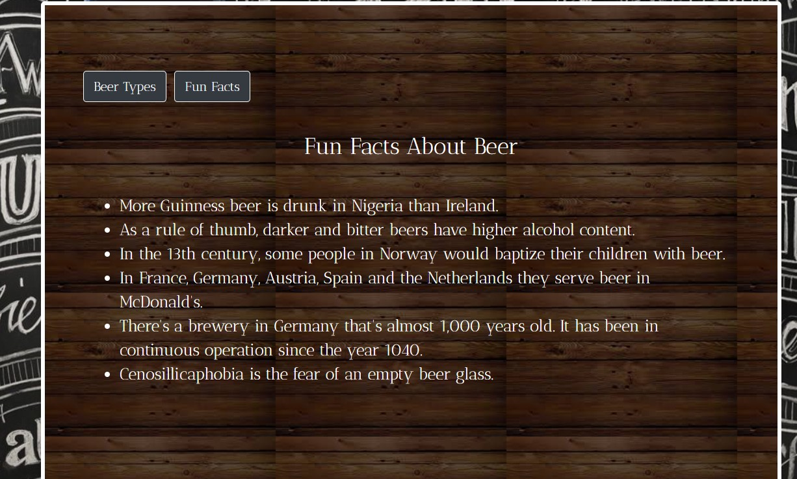

# BrewFinder

This app allows you to search the Open Brewery Db for breweries that are in the area searched. 

### Overview

You are able to search by Name, City, State, or any combination of the three. With the name search, it searches by key words. So say you know the name of the brewery has the word Dog in it, you can just type in Dog in the name search and it will give you all the results that contain the name dog. And a link to the working application. https://mc180g.github.io/BrewFinder/index.html

### Search Results

After you choose the parameters that you want the app to search and hit the Cheers button at the bottom you will recieve a list of all the Breweries that were found in the Open Brewery API.

### Contact Page

This page displays all of the contributors to this project. To see more of our work click on our name under the picture and visit our Github pages.

### Learn More

On the Learn More page, you can either checkout the different types of beers or see some fun facts about beers. This is an example of clicking on one of the different beer types.

And this is an example of the fun facts tab.

